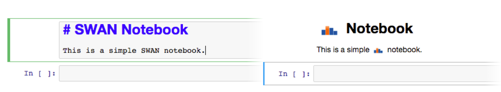

# CERN-HSF GSoC 2018
## Distributed Big Data Analysis with TDataFrame
## Exercise for Candidate Students

This repository contains an exercise to evaluate those students interested in applying for the *Distributed Big Data Analysis with TDataFrame* project, included in the Google Summer of Code (GSoC) program and offered by the [EP-SFT](http://ep-dep-sft.web.cern.ch/) group and the [IT](http://information-technology.web.cern.ch/) department at CERN. The detailed description of the project can be found [here](http://hepsoftwarefoundation.org/gsoc/2018/proposal_ROOTspark.html).

The exercise is divided into two tasks. In order to complete the first one no programming is required, but the student will need to combine a set of technologies that are important for the project, namely [Python](https://www.python.org/), [Spark](http://spark.apache.org/), [ROOT](https://root.cern/) (with [TDataFrame](https://root.cern.ch/doc/v612/classROOT_1_1Experimental_1_1TDataFrame.html)) and [Jupyter notebooks](http://jupyter.org/). The second task does involve programming and it aims to test the student's skills with [JavaScript](https://www.javascript.com/).

Please follow the guidelines below to go through the exercise and work at a pace that suits you. We recommend that you start with the first task and, only if you successfully complete it, you go for the second one. Do not hesitate to ask us, the mentors, any question you might have.

### *TASK 1: Execute a Jupyter notebook that contains a ROOT distributed analysis*

The objective of this task is to execute a Python Jupyter notebook whose code corresponds to a data analysis that uses ROOT's TDataFrame. The analysis is distributed with Spark thanks to the DistROOT module.

In preparation for this task you will need to:
* Install ROOT v6.12/06, which you can download from [here](https://root.cern/content/release-61206).
* Install Spark on your machine and run some simple test locally.
* Install Jupyter on your machine and launch a local notebook server.
* Download the [test notebook](Spark_DistROOT_TDataFrame.ipynb) and the [DistROOT module](DistROOT.py) from this repository.

Once you have set up your environment with all the software listed above, you should be able to run the test notebook. The __deliverable__ of this task is precisely that notebook after being executed and saved, that is, the notebook containing the code cells plus the generated output cells.

At the light of the results you obtained, please __answer__ the following questions:
* What is the number of rows (or entries) of the initial dataset?
* How many entries are left after applying the filters?
* Could you add another filter to cell #3 on any of the columns of the dataset? How would you specify it? What is the resulting number of entries after adding that filter?

### *TASK 2: Replace all the words “SWAN” with the SWAN logo*

The objective of this task is to write a [Jupyter Nbextension](http://jupyter-notebook.readthedocs.io/en/stable/extending/frontend_extensions.html) that replaces all the “SWAN” strings which are located inside *markdown cells* with the [SWAN logo](logo_swan_cloudhisto.png). The image should only be displayed if the extension is active, therefore only the rendered output of a markdown cell should be replaced, and not the content of the cell itself.

In preparation of this task, you will need to:
* Install Jupyter on your machine and launch a local notebook server.
* Have basic understanding about notebooks, e.g. types of cells (markdown, code).
* Understand how to install and run an Nbextension.
* Have a look at examples of notebook extensions [here](https://github.com/ipython-contrib/jupyter_contrib_nbextensions/tree/master/src/jupyter_contrib_nbextensions/nbextensions).

The __deliverable__ of this task is a packaged Jupyter Nbextension ready to be installed, which provides the functionality described above.

#### OPTIONAL: Monitor changes to cells 

The "SWAN" word replacement described in the first part of this task should also happen when a cell is modified, and not only when the notebook is loaded for the first time.

In that sense, we propose here an additional feature for your extension: listen to the markdown cell render event of Jupyter and perform the "SWAN" word replacement when that event is triggered on a particular cell. This will require that you understand how to monitor changes within cells and how to manipulate its contents.

The __deliverable__ of this part is the same packaged Jupyter Nbextension that was requested before, with the additional functionality described above.

Once you complete any of the tasks of this exercise, please send us by e-mail the requested deliverables at:
etejedor@cern.ch, diogo.castro@cern.ch, danilo.piparo@cern.ch, prasanth.kothuri@cern.ch
